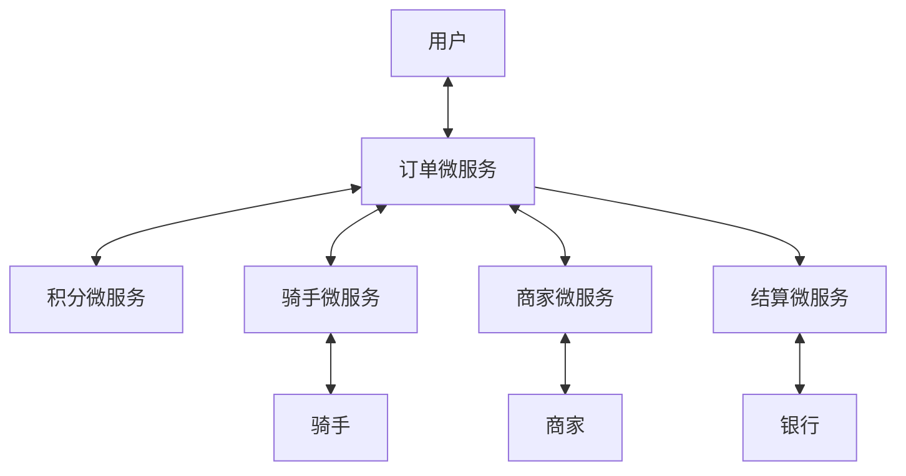
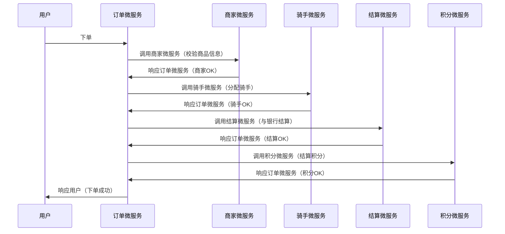
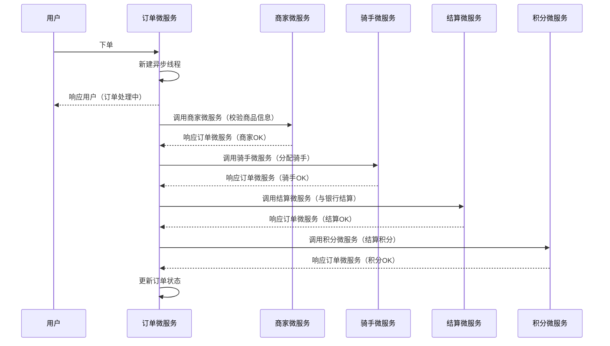
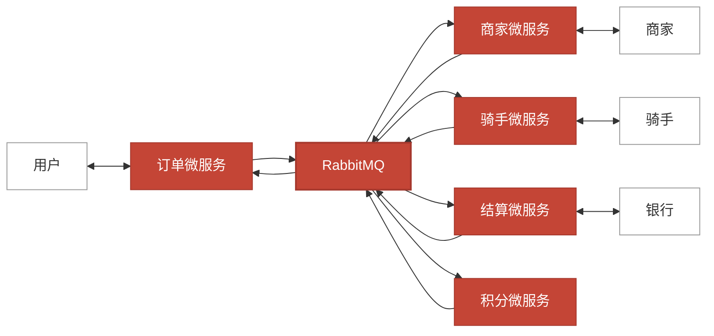

# 2-1 从找小姐姐买咖啡理解消息中间件

中间件（Middleware），是提供软件和软件之间连接的软件，以便于软件各部件之间的沟通。

“微信”就是中间件，而且是个消息中间件。

以下是订单系统各微服务的交互流程图：

## 业务流程（同步直接调用）

### 同步直接调用的问题

- 业务调用链过长，用户等待时间长
- 部分组件故障会瘫痪整个业务
- 业务高峰期没有缓冲

## 业务流程（异步直接调用）

### 异步直接调用的问题

- ~~业务调用链过长，用户等待时间长~~ ✅
- ~~部分组件故障会瘫痪整个业务~~ ✅
- ~~业务高峰期没有缓冲~~ ✅
- 业务高峰期时产生大量的异步线程，造成线程池不够用或者内存爆满

## 基于 RabbitMQ 的微服务交互架构

## 业务流程(异步消息)

### 使用消息中间件的优势

- 业务调用链短，用户等待时间短
- 部分组件故障不会瘫痪整个业务
- 业务高峰期有缓冲
- 业务高峰期时不会产生大量的异步线程

### 使用消息中间件的作用

- 异步处理
- 系统解耦
- 流量削峰和流控
- 消息广播
- 消息收集
- 最终一致性
