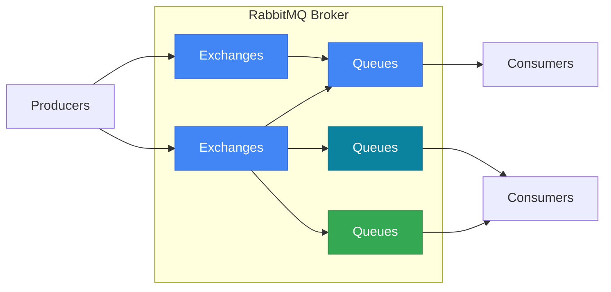

# 2-2 主流消息中间件怎么选？

## 主流消息中间件技术

- ActiveMQ
- RabbitMQ（最主流）
- RocketMQ
- Kafka

## RabbitMQ消息中间件

### RabbitMQ支持协议

- OpenWire
- STOMP
- REST
- XMPP
- AMQP

### RabbitMQ架构

- 当前最主流的消息中间件
- 高可靠性，支持发送确认，投递确认等特性
- 高可用，支持镜像队列
- 支持插件

### RabbitMQ优点

- 基于Erlang，支持高并发
- 支持多种平台，多种客户端，文档齐全
- 可靠性高
- 在互联网公司有较大规模的应用，社区活跃度高

### RabbitMQ缺点

- Erlang 语言较为小众，不利于二次开发
- 代理架构下，中央节点增加了延迟，影响性能
- 使用 AMQP 协议，使用起来有学习成本

## RocketMQ消息中间件

### RocketMQ架构

- 阿里巴巴团队开发，经受双十一考验
- 能够保证严格的消息顺序
- 亿级消息堆积能力
- 丰富的消息拉取模式

### RocketMQ优点

- 基于Java，方便二次开发
- 单机支持1万以上持久化队列
- 内存与磁盘都有一份数据，保证性能+高可用
- 开发度较活跃，版本更新很快

### RocketMQ缺点

- 客户端种类不多，较成熟的是Java及C++
- 没有Web管理界面，提供了一个CLI (命令行界面)
- 社区关注度及成熟度不如RabbitMQ

## Kafka消息中间件

### Kafka架构

- LinkedIn开发的分布式的日志提交系统
- 独特的分区特性，适用于大数据系统
- 性能高效、可扩展良好
- 可复制、可容错

### Kafka优点

- 原生的分布式系统
- 零拷贝技术，减少IO操作步骤，提高系统吞吐量
- 快速持久化：可以在O(1)的系统开销下进行消息持久化
- 支持数据批量发送和拉取

### Kafka缺点

- 单机超过64个队列/分区时，性能明显劣化
- 使用短轮询方式，实时性取决于轮询间隔时间
- 消费失败不支持重试
- 可靠性比较差

## 总结

- ActiveMQ最“老”，老牌，但维护较慢
- RabbitMQ最“火”，适合大小公司，各种场景通杀
- RocketMQ最“猛”，功能强，但考验公司运维能力
- Kafka最“强”，支持超大量数据，但消息可靠性弱
